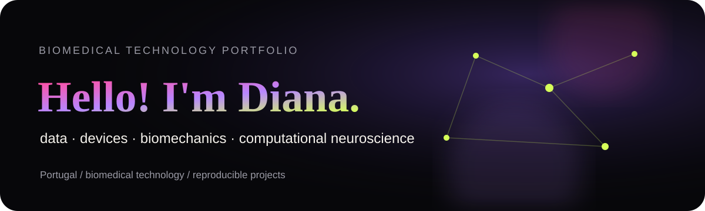
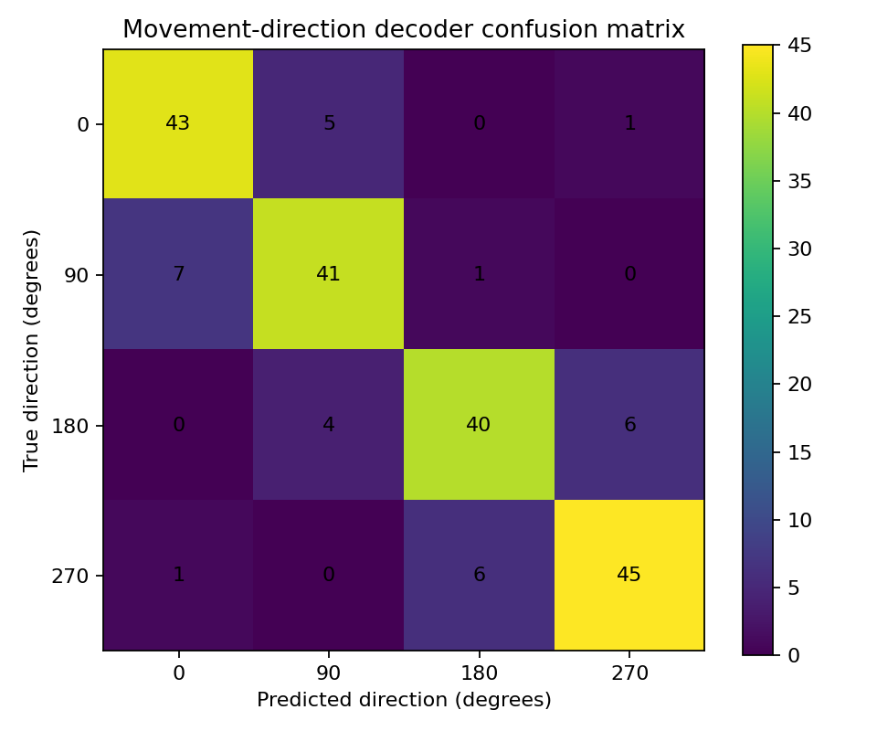

<p align="center">
  
</p>

<table>
<tr>
<td width="31%" valign="top">


### Diana Alves

**Biomedical Technology student**<br />
Portugal 🇵🇹

[](https://diana-neurotech-portfolio.vercel.app)
[](https://github.com/dianaalves397)

</td>
<td width="69%" valign="top">

## 🚀 About me

I am completing a degree in **Biomedical Technology at ESTSetúbal, Polytechnic Institute of Setúbal**, building at the intersection of biomedical engineering, data and computational neuroscience.

My academic knowledge spans biomedical systems, electronics, data and life sciences. I am progressively directing that multidisciplinary base toward **computational neuroscience, neural decoding, computational motor control and neurotechnology**.

- 🧠 Building reproducible projects around **neural decoding**
- 🦾 Interested in **motor control, BCI and neuroprosthetics**
- 📊 Strengthening **Python, statistics, data analysis and machine learning**
- 🔬 Moving from synthetic experiments toward **public neural datasets**
- 🧩 Interested in translating research into **useful biomedical products**

### ✦ Current focus

`neural populations` · `motor behaviour` · `decoding` · `reproducibility` · `biomedical innovation`

</td>
</tr>
</table>

---

## 🛠 Capabilities

### Demonstrated through projects

Evidence from the projects and source code in this repository:

| Area | Demonstrated work |
| --- | --- |
| Neural decoding | Introductory synthetic neural population modelling and motor-intention classification |
| Machine learning | Logistic regression, feature standardization, stratified splitting and 5-fold cross-validation |
| Model evaluation | Accuracy, classification reports, confusion matrices and reproducible output files |
| Programming & data | Python, NumPy, pandas, scikit-learn, Matplotlib, file/data processing and basic ML workflows |
| Engineering practice | Git/GitHub, debugging, regression testing, pytest and reproducible computational experiments |
| Web | HTML, CSS and JavaScript used to build this editorial portfolio |

`pandas` is included because it is used directly for labelled neural datasets and CSV result export. The repository does not present introductory neural modelling as advanced neuroscience expertise.

### Academic knowledge

These are competencies studied and applied in the multidisciplinary **Biomedical Technology** degree through coursework, projects and laboratory work. They are real academic knowledge, presented without implying professional experience, advanced specialization or research-laboratory employment.

| Area | Academic knowledge |
| --- | --- |
| Biomedical Electronics & Instrumentation | Analog electronics; diodes, BJT and MOSFET; circuit analysis, simulation, assembly and measurements; sensors, transducers, operational/differential amplification, analog filters, ADC/DAC, signal conditioning and biomedical acquisition |
| Statistics & Data | Descriptive statistics, probability and distributions, sampling and estimation, confidence intervals, parametric/non-parametric hypothesis tests, chi-square, Wilcoxon/Mann–Whitney, regression, correlation, residual analysis, R and biomedical-data interpretation |
| Databases | Relational databases, entity–relationship modelling, normalization, SQL and data manipulation; XML, XML Schema/DTD, XPath and information modelling |
| Biomaterials | Biomaterial–tissue interaction and biocompatibility; stainless steel, titanium alloys, CoCr and Nitinol; ceramics, calcium phosphates, polymers, hydrogels and composites; drug delivery, coatings, characterization and degradation |
| Biomechanics | Newtonian mechanics, statics and dynamics, forces and moments, free-body diagrams, center of mass, kinematics, biomechanics and quantitative human-movement analysis |
| Medical Devices | Risk classification, regulation and vigilance fundamentals; diagnostic, monitoring, implantable, surgical and life-support devices; biomedical equipment, electrical safety, limitations and error sources |
| Biomedical & Molecular Sciences | Human anatomy and physiology, biochemistry, cell and molecular biology, membranes and transport, extracellular matrix, proteins, DNA/RNA, gene expression and regulation, cell cycle, apoptosis, mutations and introductory PCR, electrophoresis and sequencing concepts |
| Medical Product Development | Needs, requirements and specifications; concept generation and selection, product architecture, prototyping, technical drawing, CAD/3D-modelling fundamentals and prosthesis, orthosis, implant and rehabilitation-device design contexts |
| Digital Health | Digital-health fundamentals, telemedicine, health information technologies and remote-healthcare concepts |

The interactive [portfolio](https://diana-neurotech-portfolio.vercel.app#capabilities) presents this as a capability atlas with explicit **Demonstrated**, **Academic knowledge**, and **Currently building toward** context rather than a skill wall.

---

## 🧠 Featured project — Movement Intention Decoder

<table>
<tr>
<td width="58%" valign="top">

A reproducible introductory neural-decoding pipeline using **synthetic direction-tuned neural population activity**—not experimental or clinical recordings.

It simulates 40 neurons, generates spike-count-like observations, standardizes the features and trains a logistic-regression decoder to predict movement direction.

**Results from the reproducible run**

- Test accuracy: **84.5%**
- 5-fold CV mean: **89.6%**
- Population: **40 synthetic neurons**
- Directions: **4 classes**

[**→ Open the full project**](projects/neural-decoding-portfolio)

</td>
<td width="42%" valign="top">



</td>
</tr>
</table>

**Important scientific framing:** this is a learning project using synthetic data. It does not claim experimental neural recordings or laboratory results.

---

## 🔧 Open-source work — `emg2mu` issue #16

I investigated a `good first issue` in the open-source **emg2mu** project concerning motor-unit firings that occur closer together than the minimum physiological firing interval.

The prepared contribution:

- identifies incorrect indexing of spike events;
- recomputes close-spike pairs after each removal;
- adds a regression fixture for consecutive close spikes;
- includes a ready-to-review patch.

**Status:** prepared and locally regression-tested; **not yet submitted upstream**.

[**→ Open my contribution notes and patch**](projects/emg2mu-issue-16) · [**→ Upstream issue**](https://github.com/neuromechanist/emg2mu/issues/16)

---

## 🌐 Interactive portfolio

The same work is also presented as an experimental editorial portfolio with an interactive neural field, research constellation and project narratives.

<p align="center">
  <a href="https://diana-neurotech-portfolio.vercel.app">
    
  </a>
</p>

The website source is in the root of this repository (`index.html`, `style.css`, `script.js`) so this repository can also be the source connected to Vercel.

---

## 📈 GitHub stats

<p align="center">
  
  
</p>

---

## 🧭 What I am building toward

```text
Biomedical Technology
        ↓
Biomedical systems + electronics + data + life sciences
        ↓
Computational neuroscience + neural decoding
        ↓
Public neural datasets + stronger ML baselines
        ↓
Neurotechnology + biomedical innovation
```

<p align="center"><sub>Build carefully · document honestly · make the work findable.</sub></p>
