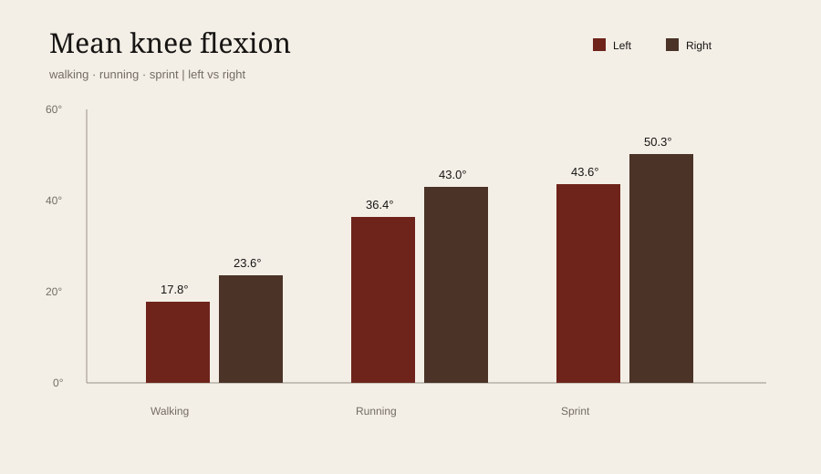
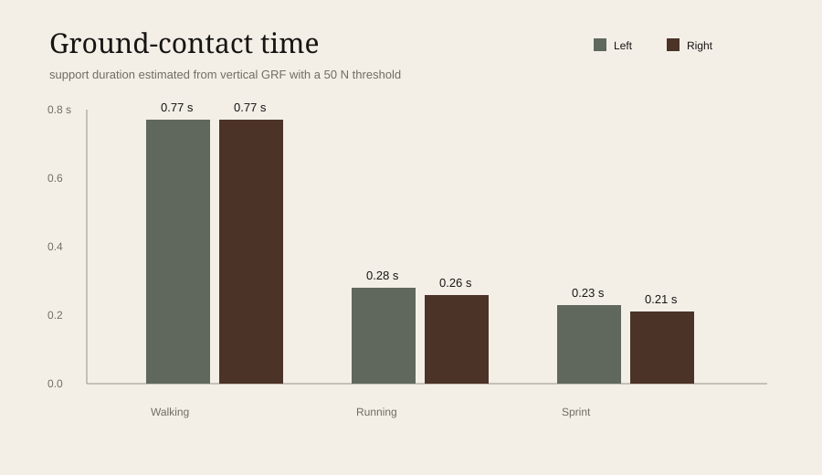

# Biomechanics Gait Analysis

**Team coursework project · Biomechanics · 2026**

A laboratory analysis of **walking, running and sprinting** using **Qualisys 3D motion capture** and force-platform data. The work followed lower-limb markers through space, calculated knee flexion from segment vectors, compared right/left symmetry and quantified how gait timing and movement amplitude changed as locomotion became faster.

## Experimental workflow

```text
Reflective markers + anthropometric measurements
                  ↓
        Static Qualisys calibration
                  ↓
      Walking / running / sprint
                  ↓
  1,000 frames per condition @ 100 Hz
                  ↓
      X/Y/Z trajectories exported
                  ↓
Kinematics + force-platform timing + statistics
```

Each dynamic condition contained **10 seconds of data**. The analysed anatomical landmarks were:

- **GT** — greater trochanter;
- **ELF** — lateral femoral epicondyle;
- **ML** — lateral malleolus.

Both left and right lower limbs were analysed.

## What was calculated

### Knee flexion

Two 3D segment vectors were constructed for every frame:

`thigh = GT - ELF`

`shank = ML - ELF`

The angle between them was calculated using the dot product:

`θ = arccos((thigh · shank) / (|thigh| |shank|))`

### Kinematics

The exported trajectories were used to analyse:

- 3D marker displacement;
- frame-to-frame velocity;
- frame-to-frame acceleration;
- vertical and anteroposterior marker amplitude.

### Variability and symmetry

For the main parameters, the analysis included mean, standard deviation and coefficient of variation.

Right-left symmetry was quantified with:

`SI = |R-L| / ((R+L)/2) × 100`

### Gait timing

Vertical ground-reaction force from the force platforms was analysed using a **50 N threshold** to identify support/no-contact intervals. Incomplete cycles at the beginning or end of the acquisition were excluded from the mean.

[**→ Full analysis methodology**](docs/methods.md)

## Results

<p align="center">
  
</p>

Mean knee flexion increased from walking to running and sprint. The right knee had the larger mean flexion in all three conditions:

| Condition | Left mean | Right mean | Left max | Right max | Symmetry index |
| --- | ---: | ---: | ---: | ---: | ---: |
| Walking | 17.8° | 23.6° | 57.4° | 63.6° | 28.4% |
| Running | 36.4° | 43.0° | 76.7° | 89.5° | 16.7% |
| Sprint | 43.6° | 50.3° | 103.1° | 113.1° | 14.3% |

<p align="center">
  
</p>

Support time decreased strongly with speed:

- **walking:** ~0.77 s on both sides;
- **running:** 0.28 s left / 0.26 s right;
- **sprint:** 0.23 s left / 0.21 s right.

At the same time, the no-contact fraction increased from roughly **39–40% in walking** to more than **63% in sprint**.

## Step and stride behaviour

Mean step time fell from approximately **0.63 s** in walking to **0.34 s** in running and **0.32 s** in sprint. Mean stride time fell from about **1.27 s** to **0.69 s** and **0.63 s**.

Estimated spatial values from the lateral-malleolus trajectories were:

| Condition | Mean step length | Mean stride length |
| --- | ---: | ---: |
| Walking | ~0.32 m | ~0.65 m |
| Running | ~0.38 m | ~0.75 m |
| Sprint | ~0.22 m | ~0.43 m |

## Marker trajectories

The distal **ML marker** showed the largest movement amplitude. Its vertical excursion increased from approximately **150.0–202.5 mm in walking**, to **254.8–287.2 mm in running**, and **455.3–478.2 mm in sprint**.

By contrast, the **GT marker** remained comparatively stable because it was closer to the pelvis/body centre, with vertical amplitudes between roughly **29.1 and 99.4 mm** across the analysed conditions.

## Interpretation

The combined results show the transition from a support-dominant walking pattern to faster locomotion characterised by:

- shorter ground-contact time;
- larger no-contact phases;
- greater knee flexion;
- larger movement of the distal lower-limb marker;
- shorter step and stride times.

One isolated right-ML acceleration value during walking was much larger than the corresponding left-side value, so it was treated during the discussion as a probable measurement/capture artefact rather than as a representative biomechanical trend.

[**→ Full results and interpretation**](docs/results.md)

## Public data included in this project

The repository contains the aggregated numerical tables extracted from the analysis:

- [`data/knee_flexion_summary.csv`](data/knee_flexion_summary.csv)
- [`data/gait_timing_summary.csv`](data/gait_timing_summary.csv)
- [`data/marker_amplitude_summary.csv`](data/marker_amplitude_summary.csv)
- [`data/ml_velocity_acceleration.csv`](data/ml_velocity_acceleration.csv)

The original report and participant-identifying material are not used as the public project page; the analysis is presented here through the technical method, aggregated values and derived visualisations.

## Tools & concepts

`Qualisys` · `3D motion capture` · `force platforms` · `Excel` · `3D vectors` · `dot product` · `kinematics` · `gait analysis` · `descriptive statistics` · `coefficient of variation` · `symmetry index` · `experimental interpretation`
