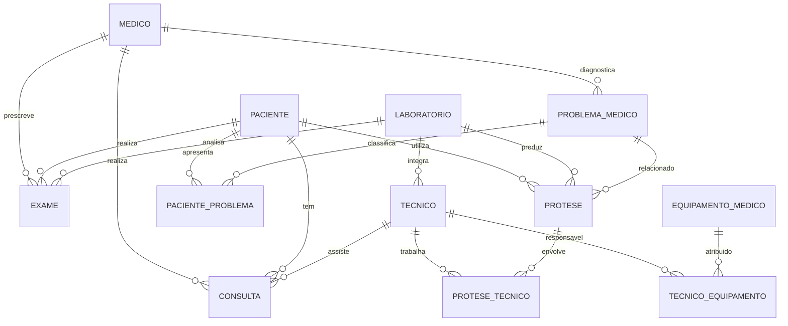

# Data model

The project models prosthesis management in a healthcare / rehabilitation setting. The relational design connects the clinical pathway, prosthesis production and follow-up, technical staff and equipment.

## Main entities

| Entity | Purpose in the system |
| --- | --- |
| `paciente` | demographic and contact information for patients |
| `medico` | clinicians responsible for consultations, exams and diagnoses |
| `tecnico` | technical professionals involved in prosthesis, examination and rehabilitation workflows |
| `laboratorio` | laboratories responsible for examinations and prosthesis production |
| `protese` | prosthesis type, material, production and installation information |
| `consulta` | clinical follow-up events linking patients and professionals |
| `exames` | diagnostic / assessment procedures associated with the patient |
| `problema_medico` | conditions and diagnoses linked to prosthesis need and follow-up |
| `equipamentos_medicos` | devices used in technical or clinical workflows |

## Associative structures

Many-to-many relationships are represented through intermediate tables, including:

- `protese_tecnico`
- `tecnico_equipamento`
- `paciente_problema`

The coursework also discussed integrity constraints, primary/foreign keys and normalization to reduce redundancy and prevent invalid references.
